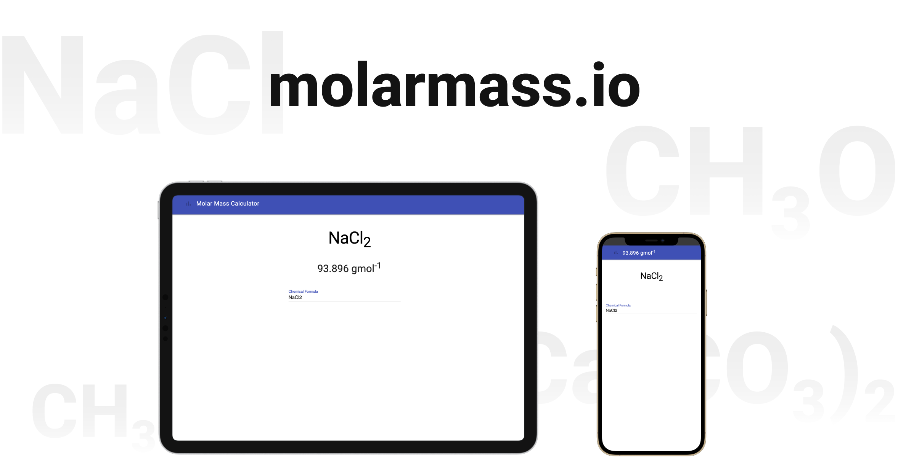

# Molar Mass Calculator

## Live Site:

You can view a live version of this application at [lasithkoswattagamage.github.io/molarmass.io](https://lasithkoswattagamage.github.io/molarmass.io/)

## Description

A Dynamic Molar Mass Calculator. Powered by the [molarmass](https://www.npmjs.com/package/molarmass) NPM library, this application will provide live molar mass updates as a chemical formula is entered.

This was a passion project that I created during a time when I was a private chemistry tutor and wanted to quickly derive the molar mass of obscure compounds



## Technology Stack

### Frontend

- HTML/CSS/JS

### Deployment

- GitHub Pages

## Local Development

### 1. Install Dependencies

```
npm install
```

### 2. Start Local Server

```
npm start
```

After you successfully started local server, visit [localhost:8080](http://localhost:8080) to access the application.
